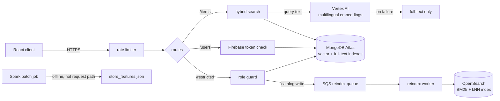

# Basket — API

Grocery prices differ enough between nearby stores that the cheapest way to buy a
basket is rarely to buy all of it in one place. Basket takes a shopping list, the
stores near you, and how many of them you are willing to visit, and works out
where to buy what.

This is the Express API: the catalogue, bilingual search, and authentication.
The React client lives in
**[BASKET_FRONTEND](https://github.com/williamhuang1261/BASKET_FRONTEND)**, which
also documents [the store-selection
solvers](https://github.com/williamhuang1261/BASKET_FRONTEND#the-interesting-part-choosing-which-stores-to-visit)
— the algorithmic core of the project.

- **Stack** — Node, Express 4, TypeScript 5, MongoDB Atlas (Mongoose), Firebase Admin, Vertex AI. Additive search-infrastructure pieces: OpenSearch, AWS SQS (via LocalStack locally), Apache Spark (Python) — see [Search infrastructure](#search-infrastructure) below.
- **Tests** — Vitest; 142 unit tests run with no credentials, integration tests need local Mongo, OpenSearch and/or LocalStack depending on what they cover
- **Data** — every product carries English and French names and descriptions

---

## Architecture



| Path | Purpose | Guard |
| --- | --- | --- |
| `POST /items/search` | Hybrid product search | rate limit |
| `POST /items/autocomplete` | Prefix suggestions | rate limit |
| `/users/account` | Create and delete accounts | Firebase token |
| `/users/info` | Read and update preferences | `isLoggedIn` |
| `/restricted/items` | Catalogue writes | `isAdmin` / `isSupplier` |

## Search

Grocery search fails in two different ways, so the API runs two retrievers and
merges them.

Someone typing `chocolate chips` wants a lexical match, and full-text search
handles it. Someone typing `something for baking cookies` needs the retrieval to
understand intent, which is what the vector side is for. Because the catalogue is
bilingual, the embeddings come from
`text-multilingual-embedding-002` and the query is tagged with its language
before being embedded, so a French query can still reach an English record.

[`getHybridSearchPipeline.ts`](src/utils/items/getHybridSearchPipeline.ts) builds
a single MongoDB aggregation that runs `$vectorSearch`, `$unionWith` the
full-text stage, groups by document to collapse products found by both, and
fuses the two scores:

```
score = 2·fts² + (2·vs²) / (fts + 9)
```

The squaring rewards a retriever that is confident rather than one that is
merely present in both lists, and the denominator lets the vector score matter
most when the lexical score is weak — which is exactly the intent-style query it
exists to serve. It is hand-tuned rather than derived, and unlike reciprocal
rank fusion it has no published behaviour to lean on. It has not been evaluated
against a labelled relevance set, so treat it as a working heuristic.

**Degradation is deliberate.** Embeddings mean a network call to Vertex AI, and
that call can fail or run slow. When it does,
[`getVectorSearchObject`](src/utils/items/getVectorSearchObject.ts) returns
`null` and the pipeline drops to full-text only rather than failing the request.
Search gets worse; it does not go down.

## Search infrastructure

Three additive pieces, built for a posting that named OpenSearch, SQS and
Spark explicitly. None of them replace the MongoDB Atlas path above — it is
still what the client actually calls. See
[`docs/prd-search-infra-extension.md`](../BASKET_FRONTEND/docs/prd-search-infra-extension.md)
for the full scoping and honesty notes; the short version is below.

**OpenSearch** ([`src/search/opensearch/`](src/search/opensearch)) is a
second hybrid search backend: BM25 `match` plus a `knn` query, combined in a
`bool`/`should` clause. `buildQuery.ts` is a pure function, unit-tested with
no live cluster. `benchmarkSearch.ts` actually indexes the sample catalog
into a real local OpenSearch container and prints measured latency for
BM25-only vs. hybrid mode — not a claimed number against Atlas, since this
project has never had a paid Atlas cluster to test against. Its kNN vectors
come from `sandboxEmbedding.ts`, a clearly-labelled, dependency-free
stand-in for the real Vertex AI embeddings `getEmbeddings.ts` already
computes for MongoDB — no live GCP call needed just to exercise the kNN
code path.

**SQS** ([`src/queue/`](src/queue)) moves the OpenSearch side of a catalog
write off the request path. `POST /restricted/items/populate` still writes
to MongoDB synchronously exactly as before; it now also enqueues a reindex
message (best-effort — a queue failure is logged, not thrown, so it can
never fail a write that already succeeded). A separate worker
(`npm run queue:worker`) consumes the queue and calls the real OpenSearch
indexing path, reusing each item's Vertex AI embedding already stored in
MongoDB.

**Spark** ([`analytics/`](analytics), Python) is a batch counterpart to the
frontend's per-request `computeVisitCostByStore`: a `pyspark` job joins the
sample catalog against a small store-coordinates dataset and writes
per-store catalog coverage, average price, cheapest-price share and travel
distance to `analytics/output/store_features.json`, once, offline, instead
of recomputing distance for every basket. Run it with
`cd analytics && pip install -r requirements.txt && python3 precompute_store_features.py`.
Its Haversine distance is a small, separate Python reimplementation of the
frontend's TypeScript formula — a batch job in a different runtime doesn't
share code across that language boundary.

Bring up the local OpenSearch and LocalStack containers with
`docker compose -f docker-compose.dev.yml up -d`.

## Data model

An item is not a product on a shelf — it is a product that several suppliers all
sell, each at their own price, under their own brand, in their own package size.
[`models/items.ts`](src/models/items.ts) keeps a single item document with an
array of supplier offers, keyed by a real barcode standard (`PLU`, `UPC`, `EAN`)
so the same product resolves across chains.

Quantities are stored as a method (`weight`, `volume`, `unit`), a unit, and a
count, with an `isApprox` flag for items sold loose. That is what lets the client
normalise everything to a comparable unit price; a `2 kg` bag and a `4 lb` bag
have to end up on the same axis before any comparison means anything.

## Experimentation

The frontend's savings-summary screen A/B-tests two ways of framing the same
savings number (see [BASKET_FRONTEND's "Experimentation"
section](https://github.com/williamhuang1261/BASKET_FRONTEND#experimentation)
and [`docs/prd-ab-testing.md`](https://github.com/williamhuang1261/BASKET_FRONTEND/blob/main/docs/prd-ab-testing.md)
for the hypothesis). This API side logs the events and scores the result.

- `POST /events` validates and persists an event
  ([`models/experimentEvent.ts`](src/models/experimentEvent.ts)):
  `experimentId`, `variant` (`A`/`B`), `eventType` (`exposure`/`conversion`),
  and an anonymous `sessionId`. Same Joi-in-`src/validation`,
  Mongoose-model conventions as the rest of the API.
- `npm run analyze:experiment -- <experimentId>`
  ([`scripts/analyzeExperiment.ts`](src/scripts/analyzeExperiment.ts)) reads
  the logged events, prints each variant's conversion rate, and, once both
  variants have at least 30 exposures, a chi-square significance readout
  ([`utils/chiSquare.ts`](src/utils/chiSquare.ts), unit-tested against a
  hand-worked 2x2 example). Below that threshold it prints "insufficient
  data" rather than a number computed from too little to mean anything.
- **No real production traffic exists yet.** Any conversion rate or
  significance this prints today comes from seeded or manually-generated
  test events. It demonstrates the pipeline and the chi-square math, not a
  real product decision — see `docs/prd-ab-testing.md`.
- The screen's personas, journey map and wireframes (including a proposed,
  unimplemented revision) live in the frontend's
  [`docs/design/`](https://github.com/williamhuang1261/BASKET_FRONTEND/tree/main/docs/design).

## Security

- Firebase ID tokens are verified server-side by `firebase-admin`; the API never
  trusts a client-supplied identity.
- `isLoggedIn` provisions a user record on first authenticated request, so
  sign-up and first sign-in are the same path.
- `isAdmin` and `isSupplier` gate catalogue writes behind `/restricted`.
- Every request passes a rate limiter (50 requests / 10 s) before routing.
- Request bodies are validated with Joi schemas in
  [`src/validation`](src/validation) before reaching a handler.
- All configuration is read from the environment. Nothing sensitive is committed.

## Running it

```bash
npm install
npx vitest run tests/unit   # 142 tests, no credentials or network needed
npm run build
npm run dev
npm run analyze:experiment -- savings-summary-framing   # needs BASKET_DB_CONNECTION_STRING

# Search infrastructure (all optional, all local):
docker compose -f docker-compose.dev.yml up -d   # OpenSearch + LocalStack
npm run search:benchmark                          # needs OpenSearch running
npx vitest run tests/integration/queue             # needs LocalStack running
npm run queue:worker                               # needs LocalStack + OpenSearch + Mongo
cd analytics && pip install -r requirements.txt && python3 precompute_store_features.py
```

`npm test` also runs `tests/integration`, which is a heavier ask: those tests
talk to a real Mongo at `mongodb://localhost:27017/basket_tests`, verify
Firebase tokens against a real project, or (the new `tests/integration/queue`
suite) a real local LocalStack SQS queue, so they hang or fail rather than
silently pass if the infra they need isn't present. Run the unit suite above
for a quick check of a fresh clone.

`npm run dev` needs an environment file and will refuse to start without one —
[`src/startup/valEnv.ts`](src/startup/valEnv.ts) lists every variable it checks.
You will need:

| Group | Variables |
| --- | --- |
| Mongo | `BASKET_DB_CONNECTION_STRING` |
| Server | `PORT`, `BASKET_SERVER_HOST`, `NODE_ENV` (`development` or `test`) |
| Auth | `BASKET_JWT_PRIVATE_KEY` |
| Firebase | `BASKET_FIREBASE_*` — the eleven fields of a service-account key |
| Vertex AI | `BASKET_GOOGLEAI_PROJECT_ID`, `BASKET_GOOGLEAI_LOCATION` |
| Development | `NODE_TLS_REJECT_UNAUTHORIZED=0`, for the local self-signed certificate |
| Search infra (optional, defaults to localhost) | `OPENSEARCH_NODE` (default `http://localhost:9200`), `AWS_SQS_ENDPOINT` (unset = real AWS, set to `http://localhost:4566` for LocalStack), `AWS_REGION` (default `us-east-1`) |

Search additionally expects two MongoDB Atlas indexes on the `items` collection:
a vector index named `vector_search_index` over the `embeddings` path, and a
full-text index. Without them the search routes will not return results.

In `development` the server binds HTTPS and reads a local certificate from
`config/SSL_perms/`; `NODE_ENV=test` serves plain HTTP, which is what the
integration tests use.

## Status

A personal project, built and iterated on over about six months. It is not
deployed publicly — running it needs a Mongo cluster, a Firebase project and a
GCP project of your own. The search-infrastructure pieces (OpenSearch, SQS)
run entirely locally via Docker and need none of that.
